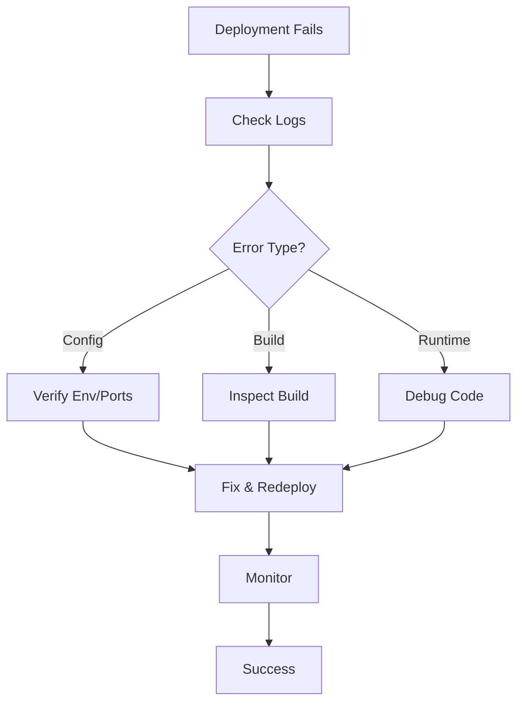
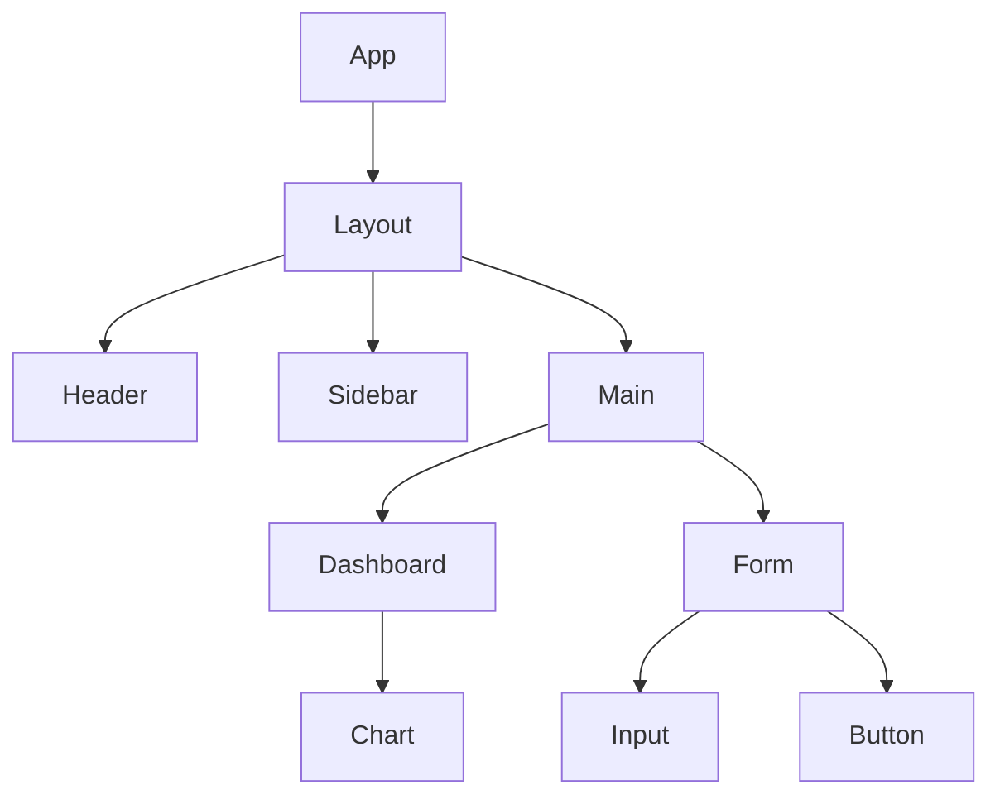

## Web Deployment Troubleshooting & UI/UX Best Practices

### Troubleshooting Common Deployment Problems

**1. Server Configuration**
- Ensure all required environment variables are set on the server (API keys, DB URLs, etc.).
- Configure CORS headers to allow requests from your frontend domain.
- Set up reverse proxy rules (Nginx/Apache) for API/backend routing.
- Use HTTPS with SSL certificates (e.g., Let’s Encrypt).

**2. Hosting Options**
- Static sites: Netlify, Vercel, GitHub Pages.
- Full-stack apps: Heroku, AWS Elastic Beanstalk, DigitalOcean, Docker containers on cloud VMs.
- Serverless: AWS Lambda, Azure Functions, Vercel/Netlify Functions.

**3. Error Handling**
- Check server and application logs for errors (500, 404, CORS, etc.).
- Ensure the build process completes without errors locally before deploying.
- Implement health endpoints and use monitoring tools (Prometheus, Sentry).

---

### Building an Attractive, User-Friendly UI Frontend

**1. Framework Best Practices (React/Vue)**
- Break UI into small, reusable components.
- Use Context API, Redux (React), or Vuex (Vue) for complex state management.
- Use React Router or Vue Router for navigation.

**2. Responsive Design**
- Start with mobile-first layouts, then scale up.
- Use CSS frameworks (Tailwind CSS, Bootstrap, Material UI) for rapid styling.
- Apply CSS media queries for breakpoints and flexible layouts.
- Leverage Flexbox and Grid for layout control.

**3. Performance Optimization**
- Use code splitting and dynamic imports.
- Compress images and use modern formats (WebP).
- Lazy load images and components.
- Minify JS/CSS assets.
- Analyze bundle size with tools like Webpack Bundle Analyzer.

**4. UI/UX Best Practices**
- Use semantic HTML and ARIA labels for accessibility.
- Stick to a design system or style guide for consistency.
- Provide user feedback (loading indicators, error messages, confirmations).
- Keep navigation simple and intuitive.

---

For specific troubleshooting or UI code samples, specify your stack or the exact issue for tailored help.
# Comprehensive Guidance on Web Deployment Troubleshooting and UI Frontend Development

This document synthesizes detailed guidance on troubleshooting web deployment issues and building user-friendly UI frontends, addressing the full query in a structured manner. It draws from best practices, pitfalls, and step-by-step approaches for each topic.

## Part 1: Troubleshooting Deployment Issues

### Common Server Configuration Issues
Server misconfigurations often cause deployment failures, including incorrect environment variables, port conflicts, dependency mismatches, and permission errors.

**Common Pitfalls:**
- Missing or incorrect env vars (e.g., API keys, database URLs).
- Firewall rules blocking ports (e.g., port 80/443).
- Incompatible runtime versions (e.g., Node.js mismatch).

**Best Practices:**
- Use Docker for consistent environments.
- Validate configs with tools like dotenv or YAML linters.
- Implement CI/CD pipelines for testing.

**Step-by-Step Troubleshooting:**
1. Check server logs (e.g., `journalctl` on Linux).
2. Verify environment variables match local and production.
3. Test ports with `telnet` or `nc`.
4. Run dependency checks (e.g., `npm ls` or `pip check`).
5. Restart services and monitor for failures.

### Hosting Options and Specific Troubleshooting
Tailor approaches to providers:

**AWS (e.g., EC2, Elastic Beanstalk, Lambda):**
- Issues: IAM denials, VPC misconfigs.
- Pitfalls: Overlooking security groups.
- Steps: Review CloudWatch logs; use AWS CLI (`aws ec2 describe-instances`); check IAM policies; test minimal deployments.

**Heroku:**
- Issues: Dyno crashes, buildpack failures.
- Pitfalls: Exceeding limits or procfile errors.
- Steps: `heroku logs --tail`; check build logs; scale dynos (`heroku ps:scale`); verify add-ons.

**Vercel:**
- Issues: Build errors, domain delays.
- Pitfalls: Git issues or vercel.json oversights.
- Steps: Inspect dashboard logs; `vercel logs`; redeploy with cache clear; check DNS.

### Error Handling Strategies
Minimize downtime with proactive measures.

**Debugging Deployment Errors:**
- Use DevTools or debuggers (e.g., pdb).
- Steps: Reproduce locally; add breakpoints; analyze stack traces; use linters (e.g., ESLint).

**Logging:**
- Structured logging with Winston or Python's logging.
- Best Practice: Log levels (info, warn, error); centralize with ELK Stack.

**Monitoring:**
- Tools: Prometheus, Grafana.
- Steps: Set alerts for CPU/memory; monitor uptime; analyze post-incident.

**General Best Practices and Pitfalls:**
- Automate with CI/CD; use version control for configs; stage rollouts.
- Avoid skipping tests, exposing secrets, or peak-hour deployments.

**Troubleshooting Flowchart:**

## Part 2: Building an Attractive and User-Friendly UI Frontend

### Best Practices for Frameworks
- **React**: Functional components with hooks (`useState`, `useEffect`); Context/Redux for state; CSS modules for styling.
- **Vue**: Composition API; Vuex/Pinia; directives and slots.

### Responsive Design Techniques
Use media queries, Flexbox/Grid, relative units (rem, vw). Frameworks like Tailwind or Bootstrap. Mobile-first; test with DevTools.

### Performance Optimization Strategies
Code splitting, lazy loading (`Suspense` in React); memoization (`React.memo`); image optimization; Lighthouse profiling.

### UI/UX Principles
Simplicity, consistency, feedback, hierarchy. User testing for intuitive navigation.

### Component Design
Modular, reusable with props. Design systems; Storybook. Example hierarchy:

### Accessibility
Semantic HTML, ARIA, keyboard nav, contrast (WCAG). Test with WAVE/axe.

### Common Pitfalls to Avoid
Overcomplicating components; neglecting responsiveness/accessibility; poor state management; inconsistent styling.

This guidance ensures reliable deployments and engaging UIs for web apps.